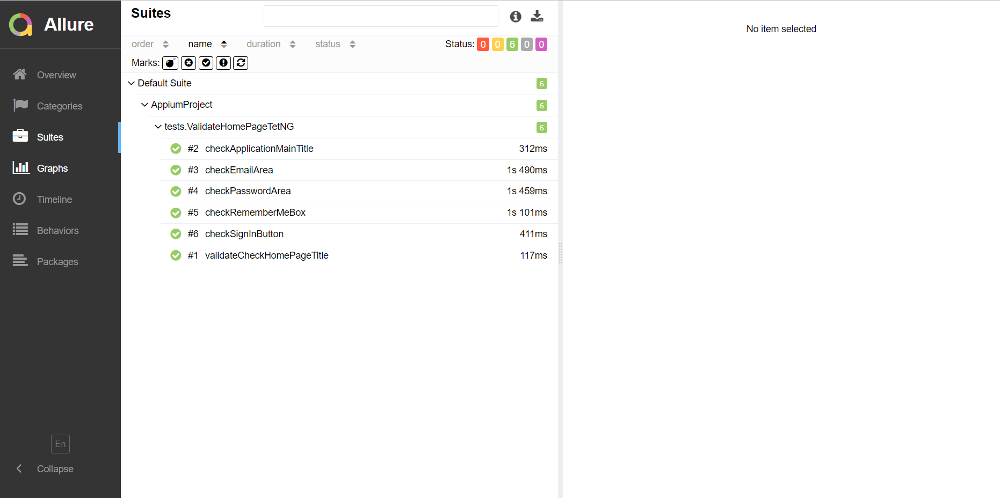
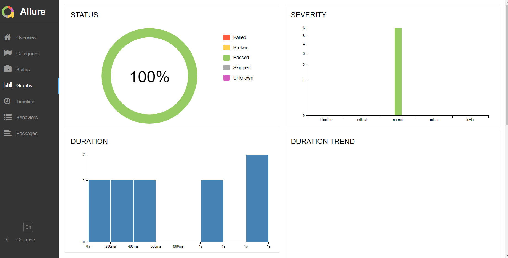
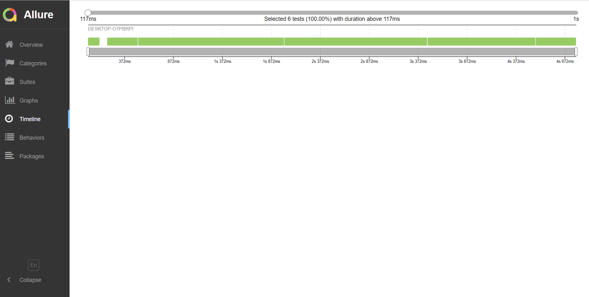

# Mobile Appium Test:

#### In this project, tests were written for the application of the path appium.apk via testNG.

#### In summary, these tests are;
*  **Application header test**
*  **Test the application subtitle**
*  **Email validity test**
*  **Password check test**
*  **Checkbox test**
*  **Button test**

#### Allure was used as the reporting method.

