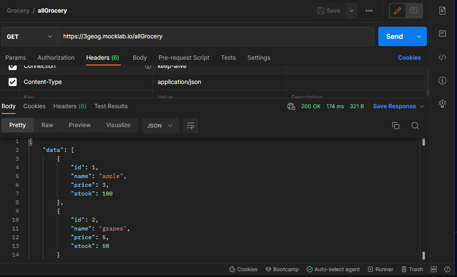
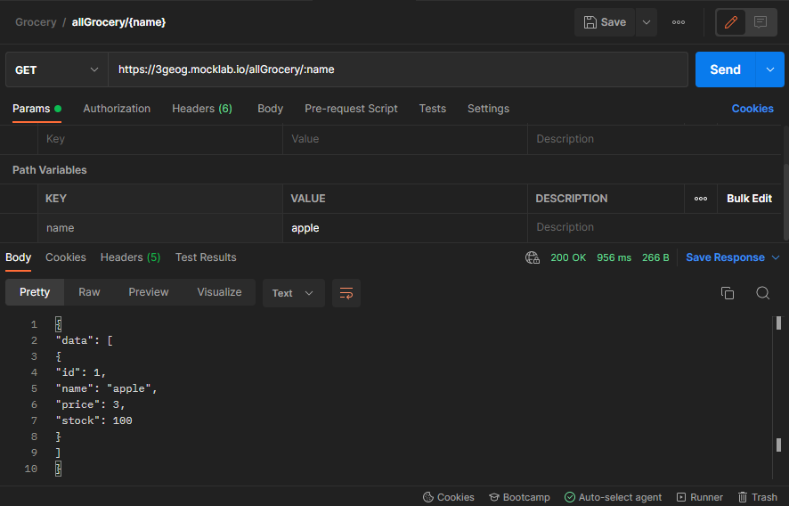
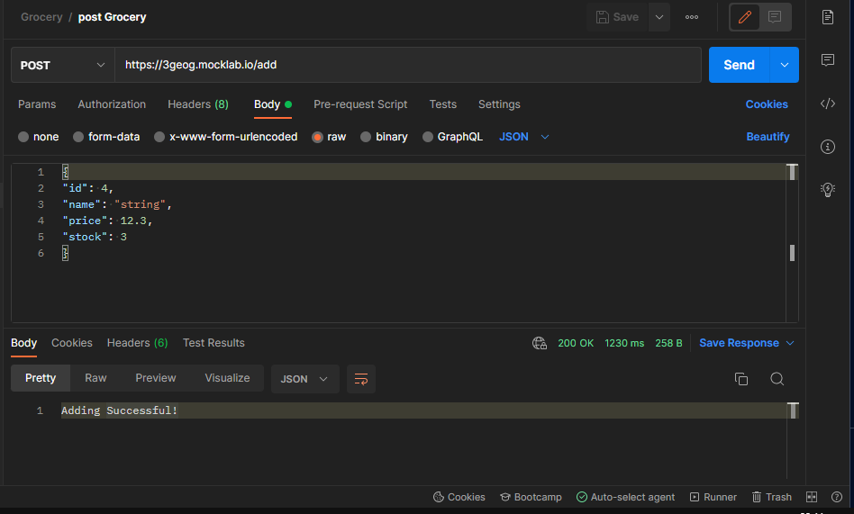

# **GROCERY STORE:**

* In this project, API services were created through MockLab. 
* Query and Path parameters were added to the specified end points.
* Necessary controls were also provided by Postman.

### GET/allGrocery:

### GET/allGrocery{name}:

### POST/add:

* Requests were made to the created services as determined and the returned response was checked.
* Restassured was used for manipulations of responses.
