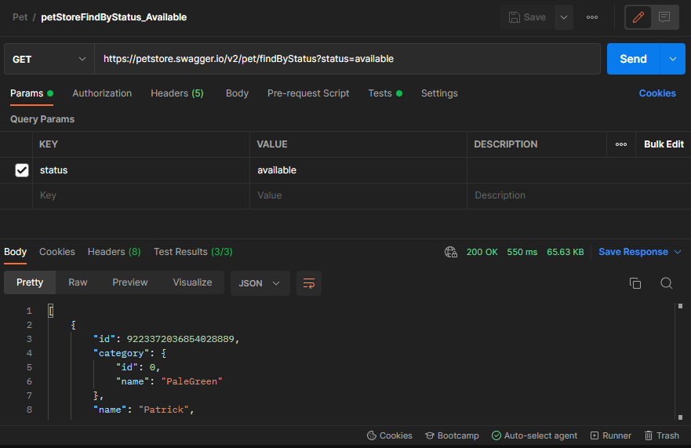
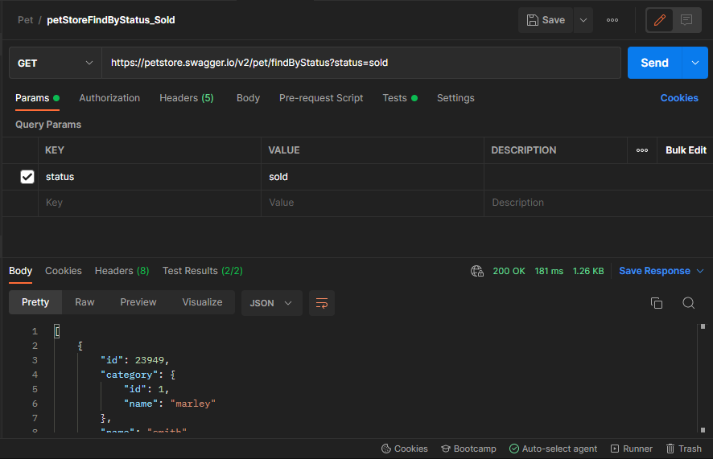
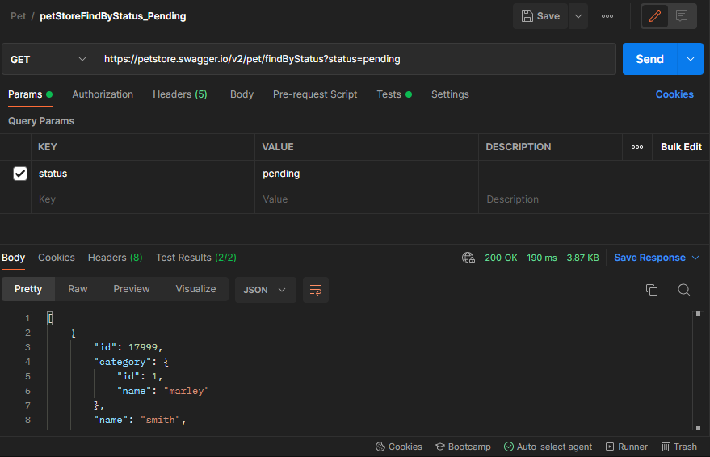
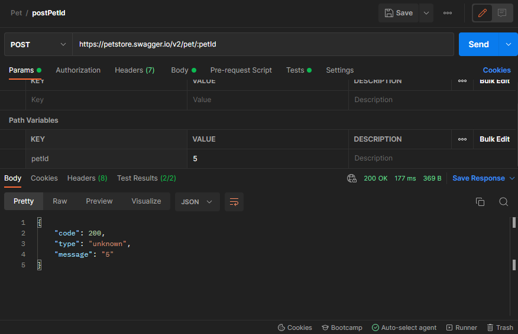
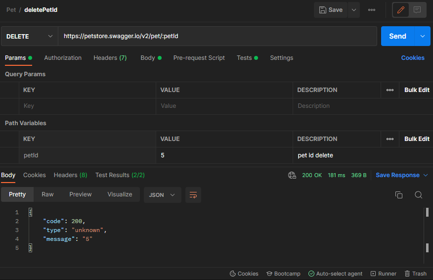

# EnUygunProject

**There are 4 projects in this repository.**
1. [Grocery Project](https://github.com/canaytsr/EnUygunProject/tree/main/GroceryApiProject)
2. [PetStore Project](https://github.com/canaytsr/EnUygunProject)
3. [Android Project](https://github.com/canaytsr/EnUygunProject/tree/main/AndroidProject)
4. [Web Automation Project](https://github.com/canaytsr/EnUygunProject/tree/main/WebAutomationProject)

## PetStore Project

**In this project, the available, sending and sold parameters were sent to the petStore service and the tests were carried out.
Unirest and httpResponse were used for this.**

**When findStatus is called, the petid of the third one is retrieved from the returned pets and the get method is called with this petid.**

**Finally, post and delete tests were written for petid.**

**While writing test methods in the project, Unirest, httpResponse and Rest assured were used.**

