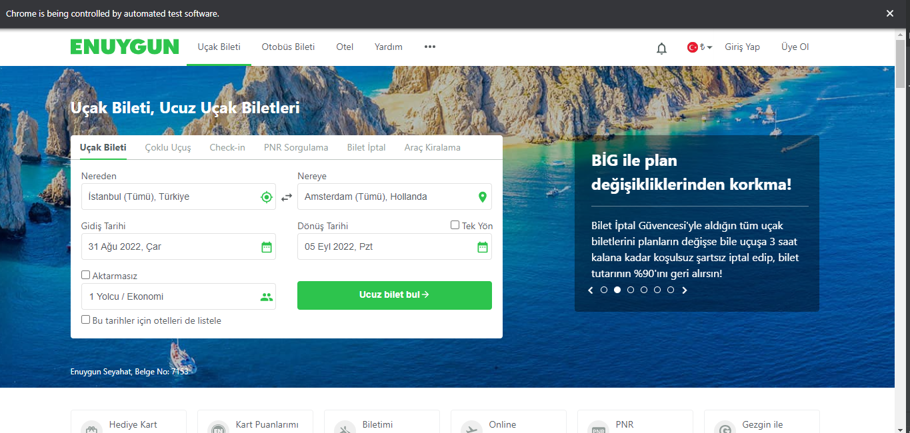
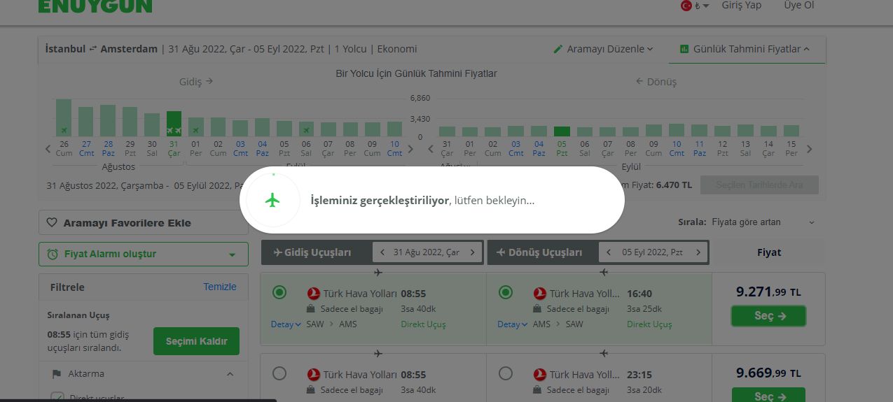
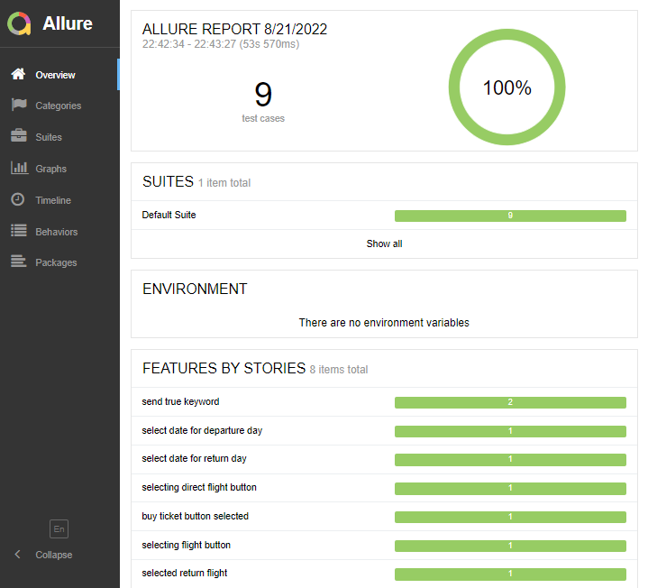
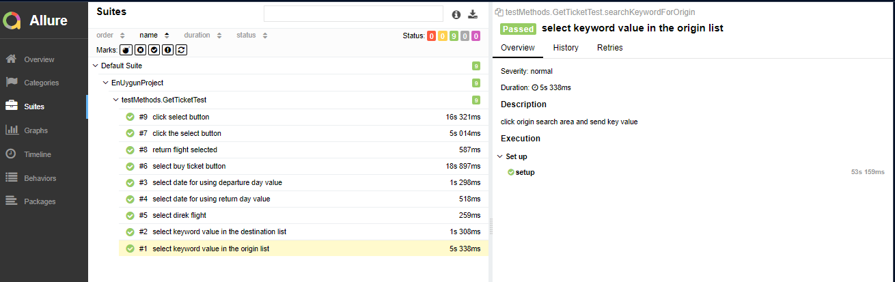
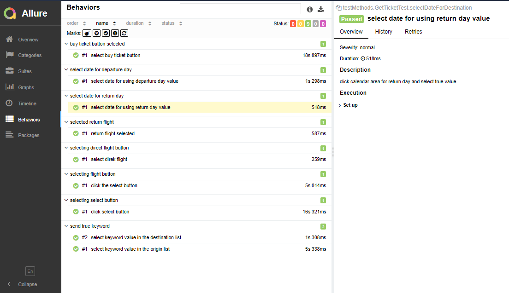

# EnUygun Web Automation Project

* ##### In this project, an automation test was written for the EnUygun website.
* ##### First, the city information dynamically obtained from the function is assigned to the departure area.
* ##### Then, the province information obtained from the function is dynamically assigned to the return field.
* ##### A future date is selected as the number of days (from today) entered dynamically.
* ##### After the departure date is determined, the choice is made by dynamically entering how many days after this date the return will be made.
* ##### The number of passengers and the number of transfers are selected and the find ticket button is clicked.
* ##### The flight of the airline company, which is dynamically taken from the page, is selected.
* ##### The flight in the same package as the selected airline is selected.
* ##### Finally, the automation process is completed by purchasing a ticket.

#### Allure was used for reporting in the project.

